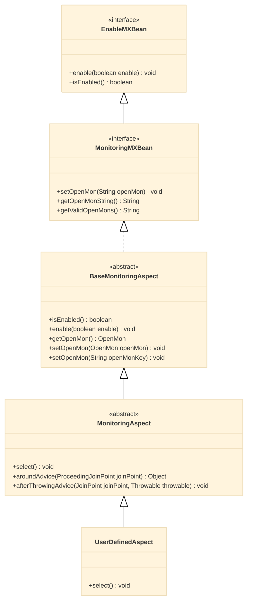
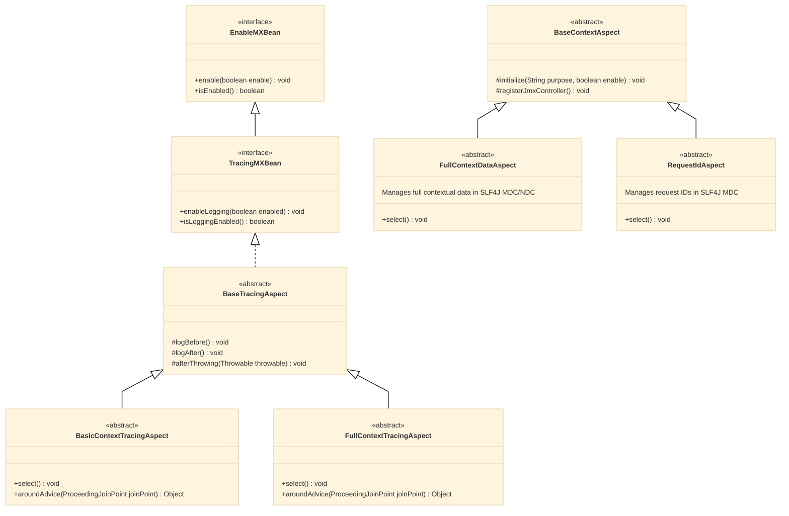

# Automon Aspects Guide

## Table of Contents

1. [Introduction to Aspects in Automon](#introduction-to-aspects-in-automon)
2. [Automon Monitoring Aspect Inheritance Structure](#the-monitoring-aspect-chain)
3. [Automon Tracing Aspect and Related Aspects and Ineritance Structure](#the-tracing-aspect-chain-and-related-aspects)
    - [Tracing Aspect Styles](#tracing-aspect-styles)
    - [Tracing Aspect Hierarchy](#tracing-aspect-hierarchy)
    - [Supporting Aspects](#supporting-aspects)
4. [Implementing Your Own Monitoring or Tracing Aspect](#implementing-your-own-monitoring-or-tracing-aspect)
    - [Monitoring Aspect Example](#monitoring-aspect-example)
    - [Tracing Aspect Example](#tracing-aspect-example)
    - [Load-Time Weaving Configuration](#load-time-weaving-configuration)
5. [What Gets Monitored and Traced](#what-gets-monitored-and-traced)
    - [Monitoring Aspects](#monitoring-aspects)
    - [Tracing Aspects](#tracing-aspects)
6. [Conclusion](#conclusion)

## Introduction to Aspects in Automon

Automon leverages the power of Aspect-Oriented Programming (AOP) to provide non-invasive monitoring and tracing capabilities for Java applications. At the core of Automon's functionality are its aspects, which allow you to inject monitoring and tracing logic into your code without modifying your existing codebase.

## The Monitoring Aspect Chain

The monitoring functionality in Automon is built around a chain of aspects, with the `MonitoringAspect` at its core. Here's a visual representation of the monitoring aspect hierarchy:



## The Tracing Aspect Chain and Related Aspects

Tracing in Automon allows you to capture detailed logs of method calls, parameters, return values, and exceptions. It provides insights into the execution flow of your application. The tracing functionality is built around a chain of aspects in the `org.automon.aspects.tracing` package.

It's important to note that Automon provides tracing aspects in two styles:

1. Annotation/@AspectJ/Spring style: Located in the `org.automon.aspects.tracing.spring` package.
2. AspectJ/native style: Located in the `org.automon.aspects.tracing.aspectj` package.

The native style aspects offer a few more capabilities than the Spring version and should be used if you're not using Spring. They work the same way as their Spring counterparts. The Spring/annotation style should be used for Spring applications if you're using Spring AOP.

Here's a visual representation of the tracing aspect hierarchy. (Note there are versions of the aspects with the same names in both the
`org.automon.aspects.tracing.spring` and `org.automon.aspects.tracing.aspectj` packages)



This diagram shows the main tracing aspects (BasicContextTracingAspect for basic tracing and FullContextTracingAspect for full featured tracing context such as the methods return value) along with two supporting aspects:

1. FullContextDataAspect: This aspect manages full contextual data in the SLF4J MDC (Mapped Diagnostic Context) and NDC (Nested Diagnostic Context) but does not log method entry/exit.

2. RequestIdAspect: This aspect manages request IDs in the SLF4J MDC. It adds a unique request ID to the MDC at the beginning of a request and removes it at the end. This is crucial for correlating log entries across multiple components or services that process the same request.

## Implementing Your Own Monitoring or Tracing Aspect

To use Automon's monitoring or tracing capabilities, you need to create your own aspect that inherits from either `MonitoringAspect` and/or one of the tracing aspects (e.g., `BasicContextTracingAspect`) and implements the `select()` pointcut. This pointcut defines which parts of your code should be monitored or traced.

Here's how you can create your own aspect:

1. Create a new class that extends the appropriate Automon aspect.
2. Implement the `select()` pointcut to specify what to monitor or trace.

You can configure your aspect either through Java code or in the `aop.xml` file, depending on whether you're using Build-Time Weaving (BTW) or Load-Time Weaving (LTW).

Example for monitoring:

```java
package com.mypackage.aspects;

import org.aspectj.lang.annotation.Aspect;
import org.aspectj.lang.annotation.Pointcut;
import org.automon.aspects.monitoring.MonitoringAspect;

@Aspect
public class MyMonitoringAspect extends MonitoringAspect {
    @Pointcut("execution(* com.mypackage.myapp.*.*(..))")
    public void select() {
    }
}
```

Example for tracing:

```java
package com.mypackage.aspects;

import org.aspectj.lang.annotation.Aspect;
import org.aspectj.lang.annotation.Pointcut;
import org.automon.aspects.tracing.spring.BasicContextTracingAspect;

@Aspect
public class MyTracingAspect extends BasicContextTracingAspect {
    @Pointcut("execution(* com.mypackage.myapp.*.*(..))")
    public void select() {
    }
}
```

In these examples, the `select()` pointcuts will monitor or trace all methods in all classes within the `com.mypackage.myapp` package.

For LTW, you would configure your aspects in `aop.xml` like this:

```xml
<aspectj>
  <aspects>
    <concrete-aspect name="com.mypackage.MyMonitoringAspect" extends="org.automon.aspects.monitoring.MonitoringAspect">
      <pointcut name="select" expression="execution(* com.mypackage.myapp.*.*(..))"/>
    </concrete-aspect>
    <concrete-aspect name="com.mypackage.MyTracingAspect" extends="org.automon.aspects.tracing.spring.BasicContextTracingAspect">
      <pointcut name="select" expression="execution(* com.mypackage.myapp.*.*(..))"/>
    </concrete-aspect>
  </aspects>
  
  <weaver>
    <include within="com.mypackage.myapp..*"/>
  </weaver>
</aspectj>
```

## What Gets Monitored and Traced

By implementing the `select()` pointcut, you're telling Automon which parts of your code to monitor or trace.

For monitoring aspects:
1. Track method execution times
2. Count method invocations
3. Track and count exceptions

This data will be collected and stored using the monitoring tool of your choice (e.g., Micrometer, JAMon, Yammer Metrics, StatsD).

For tracing aspects:
1. Log method entry and exit
2. Capture method parameters and return values (for full context tracing)
3. Log exceptions
4. Add contextual information to the SLF4J MDC/NDC

## Conclusion

By extending Automon's monitoring and tracing aspects and implementing the `select()` pointcut, you can easily add powerful monitoring and tracing capabilities to your Java application. Automon takes care of the heavy lifting, allowing you to focus on defining what to monitor and trace rather than how to do it.
For monitoring, Automon collects performance metrics and exception data, which can be visualized and analyzed using your chosen monitoring tool. This helps in identifying performance bottlenecks and tracking the health of your application.
For tracing, Automon provides detailed logs of method executions, including contextual information, which is invaluable for debugging and understanding the flow of your application. The tracing data is typically logged using SLF4J, allowing you to use your preferred logging framework for storage and analysis.
Remember, Automon is flexible and can work with various monitoring tools and logging frameworks. Make sure to configure your chosen monitoring tool and logging framework properly to visualize and analyze the data collected by your aspects.

For more detailed information on using Automon, including how to set up Load-Time Weaving and Build-Time Weaving, refer to the [Automon Tutorial](https://github.com/stevensouza/automon/blob/master/docs/automon-tutorial.md).